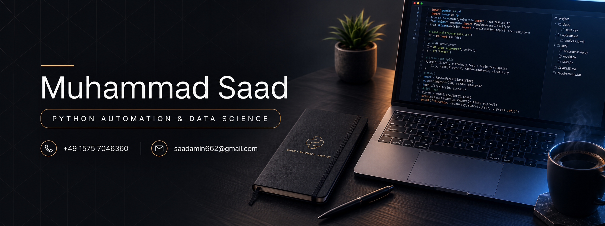

 

# Muhammad Saad Amin

**Python Automation Developer · Data Science & Machine Learning**

Frankfurt, Germany.

 

## About

I design and build Python automation systems — scraping pipelines, data workflows, and scheduled jobs that turn manual processes into reliable, hands-off ones. Alongside that, I work in data science and machine learning, from cleaning and structuring raw data through to training and evaluating models.

I also have a full-stack background (MERN), which comes in handy when a project needs an interface or API around the automation itself.

- 🔧 Building automation pipelines and data workflows in Python
- 📊 Applying data science and ML techniques to real datasets
- 🌱 Currently deepening my machine learning fundamentals
- 🤝 Open to collaborating on automation and data-driven projects
- 📄 More on my background: [saad662.github.io/portfolio](https://saad662.github.io/portfolio/)

 

## Core Stack

**Automation & Data Science**

**Tooling**

**Also Comfortable With — Full-Stack (MERN)**

 

## GitHub Stats

 

## Activity

 

*Let's connect and build something useful.*

